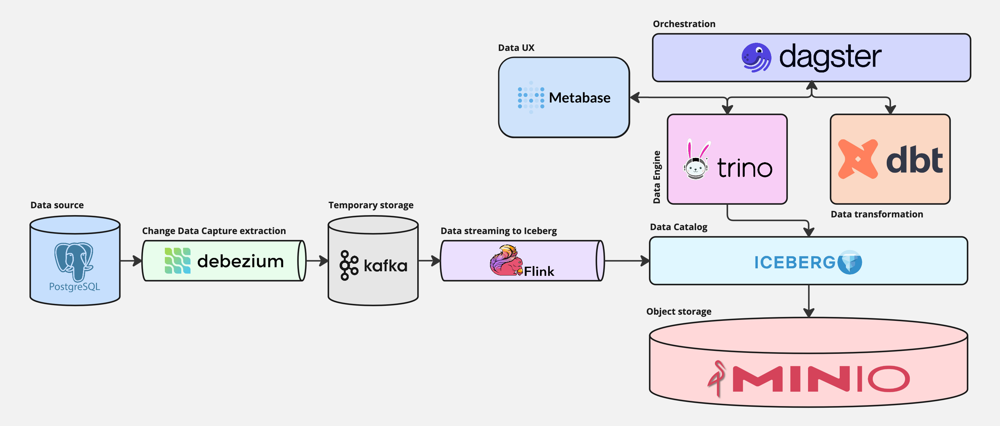

# Data Lakehouse End to End prototype

This is an end-to-end Data Lakehouse prototype built to manage real-time data ingestion, storage, and transformation for historical and incremental data tracking. Starting with PostgreSQL as the data source, Change Data Capture (CDC) events are captured by Debezium and streamed into Kafka. Flink processes and loads these events into Iceberg tables stored in Minio object storage.

Dagster orchestrates the transformations and processing within Iceberg, with dbt handling SQL transformations and Trino as the query engine. This setup supports ELT (Extract, Load, Transform) workflows and establishes a Data Vault model with historical layers, retaining all source changes for reliable data lineage and analytics.

## Getting started

This guide will help you set up and run the project locally, enabling you to replicate, store, and process streaming data in a Data Vault structure.

## Architecture and Setup



### 1. Start All Services with Docker Compose

To initialize the necessary components of the Data Lakehouse, run:

```bash
docker compose up -d
```

This command will start the following services:
- `postgres`: Source database to replicate data from.
- `connect`: Debezium connector for extracting CDC (Change Data Capture) data from PostgreSQL and sending it to Kafka.
- `kafka`: Temporary storage for CDC raw data.
- `flink-jobmanager`, `flink-taskmanager`, `flink-sql-client`: Services for streaming data from Kafka to Iceberg.
- `minio`: Object storage for data.
- `mc`: Initialization container for Minio.
- `rest`: Iceberg catalog REST API.
- `trino`: Data engine for processing data stored in Iceberg.

### 2. Set Up the Debezium Connector

To enable data replication from PostgreSQL to Kafka, create a Debezium connector by running:

```bash
curl --location 'http://localhost:8083/connectors' \
   --header 'Accept: application/json' \
   --header 'Content-Type: application/json' \
   --data '{
   "name": "bank-connector",
   "config": {
       "connector.class": "io.debezium.connector.postgresql.PostgresConnector",
       "database.hostname": "postgres",
       "database.port": "5432",
       "database.user": "postgres",
       "database.password": "password",
       "database.dbname": "bank",
       "database.server.id": "184054",
       "table.include.list": "public.users,public.accounts",
       "topic.prefix": "bank",
       "decimal.handling.mode": "string",
       "publication.name": "bank_pub",
       "slot.name": "bank_slot",
       "plugin.name": "pgoutput"
   }
}'
```

### 3. Insert Sample Data into PostgreSQL

To add data to PostgreSQL, start by connecting to the container:

```bash
docker exec -it postgres psql -U postgres
```

Then run your SQL commands to insert the necessary data.

```sql
\c bank;

INSERT INTO "users" (id, email, name)
VALUES ('1b214475-9054-4f45-91f4-d111422a7b16', 'bruce@wayne.com', 'Bruce W')
ON CONFLICT (email) DO UPDATE SET name = EXCLUDED.name
RETURNING *;


INSERT INTO "accounts" (user_id, currency, balance)
VALUES ('1b214475-9054-4f45-91f4-d111422a7b16', 'EUR', 1001.25)
RETURNING *;


INSERT INTO "users" (id, email, name)
VALUES ('dbddcfe3-a590-4358-958f-e8ed882df158', 'clark@kent.com', 'Clark Kent')
ON CONFLICT (email) DO UPDATE SET name = EXCLUDED.name
RETURNING *;


INSERT INTO "accounts" (user_id, currency, balance)
VALUES ('dbddcfe3-a590-4358-958f-e8ed882df158', 'EUR', 2500.00)
RETURNING *;

UPDATE "accounts"
SET balance = 3000.00
WHERE user_id = 'dbddcfe3-a590-4358-958f-e8ed882df158';


UPDATE "users"
SET name = 'Bruce Wayne'
WHERE email = 'bruce@wayne.com';


INSERT INTO "users" (email, name)
VALUES ('test@test.com', 'test')
ON CONFLICT (email) DO UPDATE SET name = EXCLUDED.name
RETURNING *;


DELETE
FROM "users"
WHERE email = 'test@test.com';
```

### 4. Set Up Flink for Data Replication

To start the Flink SQL client, use:

```bash
docker exec -it flink-sql-client sql-client
```

Next, run each SQL command (one at a time) to configure data replication from Kafka to Iceberg.

```sql
-- Kafka extraction

CREATE CATALOG kafka_extraction
WITH ('type'='generic_in_memory');
USE CATALOG kafka_extraction;

CREATE DATABASE bank;

CREATE TABLE `kafka_extraction`.`bank`.`users` (
  `payload` STRING
) WITH (
  'connector'='kafka',
  'topic'='bank.public.users',
  'properties.group.id'='usersRawGroup',
  'scan.startup.mode'='earliest-offset',
  'properties.bootstrap.servers'='kafka:29092',
  'value.format'='json'
);

CREATE TABLE `kafka_extraction`.`bank`.`accounts` (
  `payload` STRING
) WITH (
  'connector'='kafka',
  'topic'='bank.public.accounts',
  'properties.group.id'='accountsRawGroup',
  'scan.startup.mode'='earliest-offset',
  'properties.bootstrap.servers'='kafka:29092',
  'value.format'='json'
);


-- Iceberg loading

CREATE CATALOG iceberg
WITH (
    'type'='iceberg',
    'catalog-type'='rest',
    'uri'='http://rest:8181',
    'io-impl'='org.apache.iceberg.aws.s3.S3FileIO',
    'warehouse'='s3://warehouse',
    's3.endpoint'='http://minio:9000',
    's3.path-style-access'='true'
);
USE CATALOG iceberg;

CREATE DATABASE IF NOT EXISTS raw_data;

CREATE TABLE `iceberg`.`raw_data`.`users` (
    `data` STRING,
    `op` STRING,
    `ts_ms` BIGINT,
    `source_ts_ms` BIGINT,
    `source_tx_id` INT,
    `source_lsn` INT,
    `source_connector` STRING,
    `source_db` STRING,
    `source_schema` STRING,
    `source_table` STRING
);

CREATE TABLE `iceberg`.`raw_data`.`accounts` (
    `data` STRING,
    `op` STRING,
    `ts_ms` BIGINT,
    `source_ts_ms` BIGINT,
    `source_tx_id` INT,
    `source_lsn` INT,
    `source_connector` STRING,
    `source_db` STRING,
    `source_schema` STRING,
    `source_table` STRING
);


-- Checkpoints to commit new data every 1 minute

SET execution.checkpointing.interval = '1m';


-- Insert data from kafka to iceberg

INSERT INTO `iceberg`.`raw_data`.`users` (
    data,
    op,
    ts_ms,
    source_ts_ms,
    source_tx_id,
    source_lsn,
    source_connector,
    source_db,
    source_schema,
    source_table
)
SELECT
    CASE
        WHEN JSON_VALUE(payload, '$.op') = 'd'
            THEN JSON_QUERY(payload, '$.before')
        ELSE JSON_QUERY(payload, '$.after')
    END AS data,
    JSON_VALUE(payload, '$.op') AS op,
    CAST(JSON_VALUE(payload, '$.ts_ms') AS BIGINT) AS ts_ms,
    CAST(JSON_VALUE(payload, '$.source.ts_ms') AS BIGINT) AS source_ts_ms,
    CAST(JSON_VALUE(payload, '$.source.txId') AS INT) AS source_tx_id,
    CAST(JSON_VALUE(payload, '$.source.lsn') AS INT) AS source_lsn,
    JSON_VALUE(payload, '$.source.connector') AS source_connector,
    JSON_VALUE(payload, '$.source.db') AS source_db,
    JSON_VALUE(payload, '$.source.schema') AS source_schema,
    JSON_VALUE(payload, '$.source.table') AS source_table
FROM `kafka_extraction`.`bank`.`users`;

INSERT INTO `iceberg`.`raw_data`.`accounts` (
    data,
    op,
    ts_ms,
    source_ts_ms,
    source_tx_id,
    source_lsn,
    source_connector,
    source_db,
    source_schema,
    source_table
)
SELECT
    CASE
        WHEN JSON_VALUE(payload, '$.op') = 'd'
            THEN JSON_QUERY(payload, '$.before')
        ELSE JSON_QUERY(payload, '$.after')
    END AS data,
    JSON_VALUE(payload, '$.op') AS op,
    CAST(JSON_VALUE(payload, '$.ts_ms') AS BIGINT) AS ts_ms,
    CAST(JSON_VALUE(payload, '$.source.ts_ms') AS BIGINT) AS source_ts_ms,
    CAST(JSON_VALUE(payload, '$.source.txId') AS INT) AS source_tx_id,
    CAST(JSON_VALUE(payload, '$.source.lsn') AS INT) AS source_lsn,
    JSON_VALUE(payload, '$.source.connector') AS source_connector,
    JSON_VALUE(payload, '$.source.db') AS source_db,
    JSON_VALUE(payload, '$.source.schema') AS source_schema,
    JSON_VALUE(payload, '$.source.table') AS source_table
FROM `kafka_extraction`.`bank`.`accounts`;
```

You can monitor job statuses and view replication details on the Flink Dashboard (http://localhost:8081).
Access Minio at http://localhost:9001 (username: admin, password: password) to view the data.

## Using Dagster

### Python packages installation

First, install your Dagster code location as a Python package. By using the --editable flag, pip will install your Python package in ["editable mode"](https://pip.pypa.io/en/latest/topics/local-project-installs/#editable-installs) so that as you develop, local code changes will automatically apply.

```bash
python -m venv venv
source venv/bin/activate
pip install -e ".[dev]"
```

To start the Dagster UI web server:

```bash
dagster dev
```

Open http://localhost:3000 with your browser to see the project.

### Activating Schedules and Sensors

Activate sensors and schedules by navigating to: `Automation` -> Select all -> `Actions` -> `Start automations`

Once active, your project should be up and running! To view the lineage of all data assets, go to `Assets` -> `View global asset lineage`

## Querying Data in Trino

Final data can also be queried using Trino. To connect to Trino, use:

```bash
docker exec -it trino trino
```
And
```sql
-- Check raw data tables
USE iceberg.raw_data;
SHOW TABLES;
SELECT * FROM users;

-- Check parsed data tables
USE iceberg.parsed_data;
SHOW TABLES;
SELECT * FROM parsed_users;

-- Check data vault tables
USE iceberg.data_vault;
SHOW TABLES;
SELECT * FROM s_users;
```

## Data Analysis and Visualization with Metabase

Metabase serves as the user interface for data analysis and visualization in this Data Lakehouse prototype.
It connects directly to Trino, allowing you to explore data in Iceberg and build interactive dashboards and reports.
The container has an additional Starburst plugin to be able to connect to Trino engine.

To access Metabase, open http://localhost:3001 in your browser.