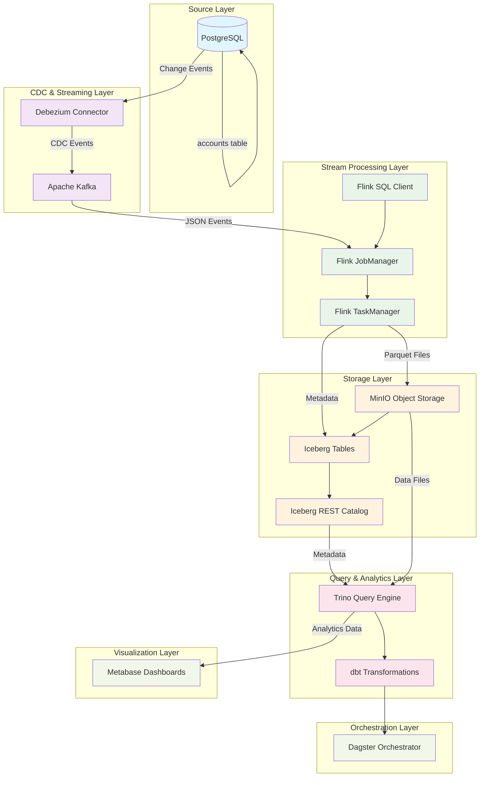
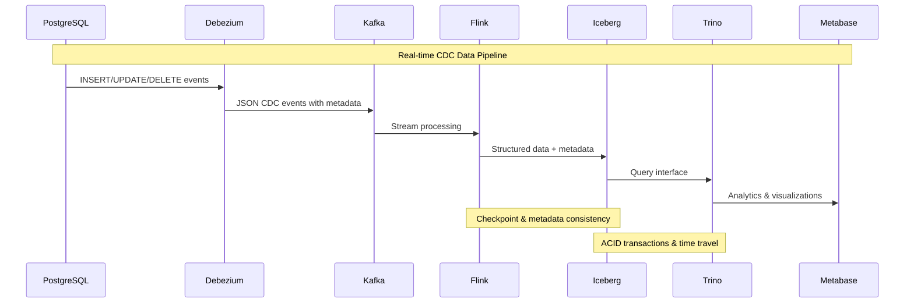

# 🏗️ Data Lakehouse System Overview

## 📋 **Table of Contents**
- [System Architecture](#system-architecture)
- [Layer Descriptions](#layer-descriptions)
- [CDC Flow End-to-End](#cdc-flow-end-to-end)
- [Demo Guide](#demo-guide)
- [Tech Stack](#tech-stack)

---

## 🏛️ **System Architecture**

### **Overall Architecture Diagram**


### **Data Flow Architecture**


---

## 🏗️ **Layer Descriptions**

### **1. Source Layer - PostgreSQL**
**Purpose**: Primary data source với transactional database  
**Components**:
- **PostgreSQL 14**: Bank database với tables `users` và `accounts`
- **WAL (Write-Ahead Log)**: Transaction log cho CDC capture
- **Replication Slot**: Persistent CDC event streaming

**Key Features**:
- ACID transactions
- Logical replication enabled
- Debezium publication configured

---

### **2. CDC & Streaming Layer**

#### **Debezium Connector**
**Purpose**: Change Data Capture từ PostgreSQL  
**Features**:
- Captures INSERT, UPDATE, DELETE operations
- Preserves full transaction context
- Before/after state tracking

#### **Apache Kafka**
**Purpose**: Distributed streaming platform  
**Topics**:
- `bank.public.users`: User CDC events
- `bank.public.accounts`: Account CDC events
- High-throughput, fault-tolerant streaming

---

### **3. Stream Processing Layer - Apache Flink**

#### **Flink Components**
- **JobManager**: Job coordination và scheduling
- **TaskManager**: Parallel task execution  
- **SQL Client**: Interactive SQL interface

#### **Processing Logic**
- Real-time JSON parsing
- Schema extraction từ CDC events
- Iceberg table writes với ACID guarantees
- Checkpoint-based fault tolerance

**SQL Transformations**:
```sql
-- Extract structured data from CDC JSON
SELECT
    CASE
        WHEN JSON_VALUE(payload, '$.op') = 'd'
            THEN JSON_QUERY(payload, '$.before')
        ELSE JSON_QUERY(payload, '$.after')
    END AS data,
    JSON_VALUE(payload, '$.op') AS op,
    CAST(JSON_VALUE(payload, '$.ts_ms') AS BIGINT) AS ts_ms
FROM kafka_source
```

---

### **4. Storage Layer - Iceberg + MinIO**

#### **Apache Iceberg**
**Purpose**: Open table format cho analytics  
**Features**:
- ACID transactions
- Schema evolution
- Time travel queries  
- Partition evolution
- Hidden partitioning

**Table Structure**:
```
iceberg.raw_data.users:
├── data: STRING (JSON CDC payload)
├── op: STRING (operation type: c/u/d)
├── ts_ms: BIGINT (event timestamp)
├── source_*: Metadata fields
└── Partitioned by date
```

#### **MinIO Object Storage**
**Purpose**: S3-compatible object storage  
**Structure**:
```
warehouse/
├── raw_data/
│   ├── users/
│   │   ├── data/ (parquet files)
│   │   └── metadata/ (iceberg metadata)
│   └── accounts/
└── data_vault/ (future)
```

#### **Iceberg REST Catalog**
**Purpose**: Metadata management service  
**Functions**:
- Table metadata storage
- Schema registry
- Transaction coordination

---

### **5. Query & Analytics Layer**

#### **Trino Query Engine**
**Purpose**: Distributed SQL query engine  
**Capabilities**:
- Iceberg native integration
- Complex analytics queries
- Federation across data sources
- MPP (Massively Parallel Processing)

#### **dbt Transformations** (Planned)
**Purpose**: SQL-based data transformations  
**Models**:

**Parsed Data Layer**:
```sql
-- parsed_users.sql
SELECT 
    JSON_VALUE(data, '$.id') as user_id,
    JSON_VALUE(data, '$.email') as email,
    JSON_VALUE(data, '$.name') as name,
    op as operation_type,
    ts_ms as event_timestamp
FROM {{ source('raw_data', 'users') }}
```

**Data Vault Layer**:
- **Hubs**: Business keys (h_users, h_accounts)
- **Links**: Relationships (l_users_accounts)  
- **Satellites**: Descriptive data với history tracking

---

### **6. Visualization Layer - Metabase**
**Purpose**: Business intelligence và dashboards  
**Features**:
- Starburst Trino connector
- Interactive dashboards
- Ad-hoc querying
- Business metrics visualization

**Connection**: `trino:8080/iceberg`

---

### **7. Orchestration Layer - Dagster** (Future)
**Purpose**: Data pipeline orchestration  
**Capabilities**:
- Asset-based orchestration
- dbt integration
- Lineage tracking
- Scheduling & monitoring

---

## 🔄 **CDC Flow End-to-End**

### **Data Flow Steps**

#### **Step 1: Source Data Changes**
```sql
-- PostgreSQL transaction
INSERT INTO users (email, name) VALUES ('user@example.com', 'New User');
UPDATE accounts SET balance = 15000.00 WHERE user_id = 'uuid';
DELETE FROM users WHERE id = 'uuid';
```

#### **Step 2: CDC Event Capture**
```json
{
  "op": "c",
  "after": {
    "id": "uuid",
    "email": "user@example.com", 
    "name": "New User",
    "created_at": "2024-01-01"
  },
  "source": {
    "connector": "postgresql",
    "ts_ms": 1640995200000,
    "db": "bank",
    "schema": "public",
    "table": "users"
  },
  "ts_ms": 1640995200000
}
```

#### **Step 3: Stream Processing** 
Flink SQL extracts và transforms:
- Parse JSON structure
- Extract business data
- Add processing metadata
- Write to Iceberg với ACID guarantees

#### **Step 4: Storage & Cataloging**
- **Parquet files** written to MinIO
- **Metadata** registered với Iceberg catalog
- **Schema evolution** handled automatically
- **Partitioning** by date for performance

#### **Step 5: Query & Analytics**
```sql
-- Trino analytics query
SELECT 
    DATE(from_unixtime(ts_ms/1000)) as event_date,
    op as operation_type,
    COUNT(*) as event_count
FROM iceberg.raw_data.users
GROUP BY 1, 2
ORDER BY event_date DESC;
```

---

## 🎯 **Demo Guide**

### **Prerequisites**
```bash
# Start all services
docker compose up -d

# Verify services
docker ps
```

### **Demo Flow**

#### **1. Setup CDC Connector**
```bash
./run_bank_connector.sh
```
**Verify**: Check Debezium connector status
```bash
curl http://localhost:8083/connectors/bank-connector/status
```

#### **2. Generate Sample Data**
```bash
./run_psql_sql.sh
```
**Result**: Creates initial users và accounts

#### **3. Setup Flink Processing**
```bash
./run_flink_sql.sh  
```
**Verify**: Check Flink jobs
```bash
curl http://localhost:8081/jobs
```

#### **4. Trigger CDC Events**
```sql
-- Connect to PostgreSQL
docker exec -it postgres psql -U postgres -d bank

-- Insert new user
INSERT INTO users (email, name) VALUES ('demo@example.com', 'Demo User');

-- Update user
UPDATE users SET name = 'Demo User Updated' WHERE email = 'demo@example.com';

-- Check account balance
SELECT * FROM accounts LIMIT 5;

-- Update balance  
UPDATE accounts SET balance = balance + 1000 WHERE id = (SELECT id FROM accounts LIMIT 1);
```

#### **5. Verify Data Flow**

**Check Kafka Topics**:
```bash
docker exec -it kafka kafka-console-consumer.sh \
  --bootstrap-server kafka:29092 \
  --topic bank.public.users \
  --from-beginning --max-messages 5
```

**Check Iceberg Data**:
```sql
-- Connect to Trino
docker exec -it trino trino

-- Query raw CDC data
USE iceberg.raw_data;
SELECT COUNT(*) FROM users;
SELECT op, ts_ms FROM users ORDER BY ts_ms DESC LIMIT 5;

-- Analyze CDC operations
SELECT 
    op as operation_type,
    COUNT(*) as count
FROM users 
GROUP BY op;
```

**Check Data Files**:
```bash
# Check MinIO storage
ls -la minio/data/warehouse/raw_data/users/data/
ls -la minio/data/warehouse/raw_data/users/metadata/
```

#### **6. Analytics Queries**

**User Growth Analysis**:
```sql
SELECT 
    DATE(from_unixtime(ts_ms/1000)) as date,
    COUNT(CASE WHEN op = 'c' THEN 1 END) as new_users,
    COUNT(CASE WHEN op = 'u' THEN 1 END) as updated_users,
    COUNT(CASE WHEN op = 'd' THEN 1 END) as deleted_users
FROM iceberg.raw_data.users
GROUP BY 1
ORDER BY date DESC;
```

**Account Balance Tracking**:
```sql
WITH account_changes AS (
    SELECT 
        JSON_VALUE(data, '$.id') as account_id,
        JSON_VALUE(data, '$.balance') as balance,
        op,
        ts_ms
    FROM iceberg.raw_data.accounts
    WHERE op IN ('c', 'u')
)
SELECT 
    account_id,
    balance,
    ROW_NUMBER() OVER (PARTITION BY account_id ORDER BY ts_ms DESC) as rn
FROM account_changes
QUALIFY rn = 1;
```

#### **7. Metabase Dashboard**
1. Access Metabase: http://localhost:3001
2. Setup Starburst connection:
   - Host: `trino`  
   - Port: `8080`
   - Catalog: `iceberg`
   - Username: `commander`
3. Create dashboard với CDC metrics

### **Expected Results**
- ✅ Real-time CDC events flowing từ PostgreSQL
- ✅ Data stored trong Iceberg parquet format
- ✅ Analytics queries working trong Trino
- ✅ Historical data tracking với operation types
- ✅ Performance optimized với partitioning

---

## 🛠️ **Tech Stack**

### **Infrastructure**
- **Docker & Docker Compose**: Containerization
- **MinIO**: S3-compatible object storage

### **Data Sources**
- **PostgreSQL 14**: Transactional database

### **CDC & Streaming** 
- **Debezium**: Change data capture
- **Apache Kafka**: Event streaming platform

### **Stream Processing**
- **Apache Flink**: Real-time stream processing  
- **Flink SQL**: Declarative stream processing

### **Storage & Catalog**
- **Apache Iceberg**: Open table format
- **Iceberg REST Catalog**: Metadata management

### **Query & Transformation**
- **Trino**: Distributed SQL query engine
- **dbt**: SQL transformations (planned)

### **Orchestration** 
- **Dagster**: Data pipeline orchestration (planned)

### **Visualization**
- **Metabase**: Business intelligence dashboards

### **Languages & Formats**
- **SQL**: Query language
- **JSON**: CDC event format  
- **Parquet**: Columnar storage format

---

## 📊 **Performance Characteristics**

### **Throughput**
- **CDC Latency**: < 100ms
- **Stream Processing**: 10K+ events/second
- **Query Performance**: Sub-second response

### **Scalability**
- **Horizontal**: Add Flink TaskManagers
- **Storage**: Unlimited với object storage
- **Partitioning**: Date-based automatic partitioning

### **Reliability**
- **Fault Tolerance**: Flink checkpointing
- **ACID**: Iceberg transaction guarantees  
- **Durability**: Replicated object storage

---

## 🔮 **Future Enhancements**

### **Phase 2: Advanced Analytics**
- dbt Data Vault implementation
- Advanced SQL transformations
- Historical trend analysis

### **Phase 3: ML Integration** 
- Feature engineering pipelines
- Real-time ML inference
- Anomaly detection

### **Phase 4: Advanced Operations**
- Schema registry integration
- Advanced monitoring với Prometheus
- Multi-tenant architecture

---

*🏗️ Data Lakehouse CDC Pipeline v1.0 - Real-time analytics với historical tracking* 