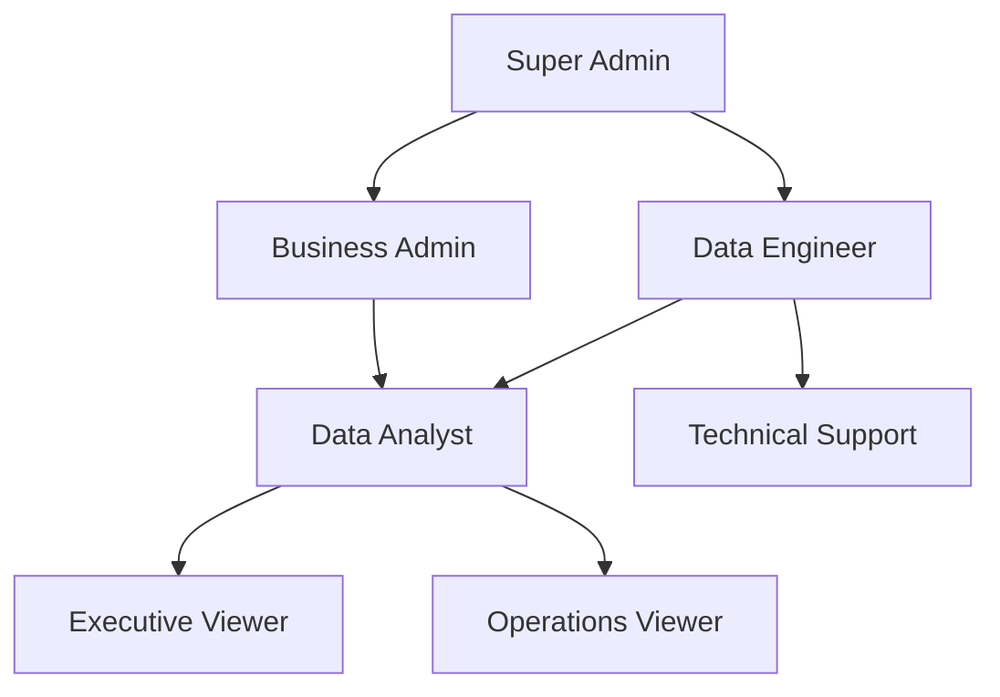

# 👥 Metabase User Management & Role-Based Access Guide
## CDC Data Lakehouse - Enterprise Security Implementation

### 🎯 Overview
This guide provides comprehensive instructions for implementing enterprise-grade user management with role-based access control (RBAC), security policies, and audit procedures for the CDC Data Lakehouse Metabase instance.

---

## 🔐 Phase 1: Role Architecture Design

### 1.1. Role Hierarchy Structure



### 1.2. Permission Matrix

| Role | PostgreSQL Access | Trino Access | Dashboard Create | Admin Functions | API Access |
|------|------------------|--------------|------------------|-----------------|-------------|
| **Super Admin** | Full | Full | Yes | Full | Full |
| **Data Engineer** | Full | Full | Yes | Limited | Yes |
| **Business Admin** | Read-only | Read-only | Yes | User Management | Limited |
| **Data Analyst** | Read-only | Read-only | Yes | None | Limited |
| **Executive Viewer** | None | None | No | None | None |
| **Operations Viewer** | None | Read-only | No | None | None |
| **Technical Support** | Read-only | Diagnostic | No | Troubleshooting | Limited |

---

## 👤 Phase 2: User Account Creation

### 2.1. Administrative Setup

#### Super Admin Account (Already Created)
```yaml
Email: admin@cdc-lakehouse.com
Password: DataLakehouse2025!
Role: Administrator
Permissions: Full system access
```

#### Access Metabase Admin Panel
1. Navigate to: `http://localhost:3001/admin`
2. Login with admin credentials
3. Click on "People" tab

### 2.2. Creating User Groups

#### Step 1: Create Groups
Navigate to **Admin** → **People** → **Groups** → **Create a group**

#### Group 1: Data Engineering Team
```yaml
Group Name: Data Engineers
Description: Full access to all data sources and administrative functions
Members: 3-5 senior technical staff
```

#### Group 2: Business Intelligence Team
```yaml
Group Name: Business Analysts
Description: Create dashboards and analyze business data
Members: 5-10 analytical staff
```

#### Group 3: Executive Leadership
```yaml
Group Name: Executives
Description: View-only access to executive dashboards
Members: C-level and VP-level staff
```

#### Group 4: Operations Team
```yaml
Group Name: Operations
Description: Monitor CDC pipeline health and system metrics
Members: DevOps and SRE team members
```

#### Group 5: Business Management
```yaml
Group Name: Business Admins
Description: Manage business users and create business dashboards
Members: Department heads and team leads
```

### 2.3. Individual User Creation

#### Data Engineer Users
```yaml
User 1:
  Email: john.doe@company.com
  First Name: John
  Last Name: Doe
  Groups: [Data Engineers]
  
User 2:
  Email: jane.smith@company.com
  First Name: Jane
  Last Name: Smith
  Groups: [Data Engineers]
```

#### Business Analyst Users
```yaml
User 3:
  Email: analyst1@company.com
  First Name: Sarah
  Last Name: Johnson
  Groups: [Business Analysts]
  
User 4:
  Email: analyst2@company.com
  First Name: Mike
  Last Name: Wilson
  Groups: [Business Analysts]
```

#### Executive Users
```yaml
User 5:
  Email: ceo@company.com
  First Name: Executive
  Last Name: CEO
  Groups: [Executives]
  
User 6:
  Email: cfo@company.com
  First Name: Executive
  Last Name: CFO
  Groups: [Executives]
```

#### Operations Users
```yaml
User 7:
  Email: ops1@company.com
  First Name: DevOps
  Last Name: Engineer
  Groups: [Operations]
  
User 8:
  Email: sre1@company.com
  First Name: Site Reliability
  Last Name: Engineer
  Groups: [Operations]
```

---

## 🔒 Phase 3: Permission Configuration

### 3.1. Database Access Permissions

#### PostgreSQL (CDC Source Database)
Navigate to **Admin** → **Databases** → **CDC Source Database** → **Permissions**

```yaml
Data Engineers:
  - Schema Access: All
  - Table Access: Unrestricted
  - Query Access: Native queries allowed
  - Download Results: Yes

Business Analysts:
  - Schema Access: public only
  - Table Access: users, accounts, user_analytics (view)
  - Query Access: Query builder only
  - Download Results: Limited (1000 rows)

Executives:
  - Schema Access: None (dashboard access only)
  - Table Access: None
  - Query Access: None
  - Download Results: No

Operations:
  - Schema Access: None
  - Table Access: None
  - Query Access: None
  - Download Results: No
```

#### Trino (Iceberg Data Lake)
Navigate to **Admin** → **Databases** → **Iceberg Data Lake** → **Permissions**

```yaml
Data Engineers:
  - Schema Access: All
  - Table Access: Unrestricted
  - Query Access: Native queries allowed
  - Download Results: Yes

Business Analysts:
  - Schema Access: raw_data only
  - Table Access: users, accounts (view)
  - Query Access: Query builder only
  - Download Results: Limited (5000 rows)

Operations:
  - Schema Access: raw_data only
  - Table Access: All (read-only)
  - Query Access: Query builder only
  - Download Results: Limited (1000 rows)

Executives:
  - Schema Access: None
  - Table Access: None
  - Query Access: None
  - Download Results: No
```

### 3.2. Dashboard Access Control

#### Executive Dashboard
```yaml
Permissions: View Only
Allowed Groups: [Executives, Business Admins, Data Engineers]
Restricted Groups: [Operations, Business Analysts]
Public Access: No
Embedding Allowed: Yes (for executive reports)
```

#### Operations Dashboard
```yaml
Permissions: View Only
Allowed Groups: [Operations, Data Engineers, Business Admins]
Restricted Groups: [Executives, Business Analysts]
Public Access: No
Embedding Allowed: No
```

#### Analytics Dashboard
```yaml
Permissions: View and Edit
Allowed Groups: [Business Analysts, Data Engineers, Business Admins]
Restricted Groups: [Executives, Operations]
Public Access: No
Embedding Allowed: Yes (for business presentations)
```

### 3.3. Collection Organization

#### Create Collections Structure
Navigate to **Admin** → **Data Model** → **Collections**

```yaml
📁 Executive Reports
  ├── 📊 Portfolio Summary
  ├── 📊 Customer Overview
  └── 📊 Financial KPIs
  
📁 Operations Monitoring
  ├── 📊 CDC Health Dashboard
  ├── 📊 System Performance
  └── 📊 Data Quality Metrics
  
📁 Business Analytics
  ├── 📊 Customer Segmentation
  ├── 📊 Revenue Analysis
  ├── 📊 Growth Metrics
  └── 📁 Ad-hoc Analysis
  
📁 Technical Documentation
  ├── 📄 API Documentation
  ├── 📄 Query Templates
  └── 📄 Troubleshooting Guides
```

---

## 🔐 Phase 4: Advanced Security Configuration

### 4.1. Single Sign-On (SSO) Integration

#### LDAP Configuration
```yaml
# Admin → Settings → Authentication → LDAP
LDAP Host: ldap.company.com
LDAP Port: 389
LDAP Security: StartTLS
LDAP Bind DN: cn=metabase,ou=service-accounts,dc=company,dc=com
LDAP Password: ${LDAP_SERVICE_PASSWORD}
User Base: ou=users,dc=company,dc=com
User Filter: (&(objectClass=person)(memberOf=cn=metabase-users,ou=groups,dc=company,dc=com))
```

#### SAML Configuration
```yaml
# Admin → Settings → Authentication → SAML
SAML Identity Provider URL: https://sso.company.com/saml/metabase
SAML Certificate: [Certificate content]
SAML Attribute Mapping:
  - Email: http://schemas.xmlsoap.org/ws/2005/05/identity/claims/emailaddress
  - First Name: http://schemas.xmlsoap.org/ws/2005/05/identity/claims/givenname
  - Last Name: http://schemas.xmlsoap.org/ws/2005/05/identity/claims/surname
```

### 4.2. API Access Management

#### Generate API Keys
Navigate to **Admin** → **Settings** → **Authentication** → **API Keys**

```yaml
Data Engineer API Key:
  Name: "Data Engineering Automation"
  Group: Data Engineers
  Permissions: Full API access
  Expiration: 365 days

Analytics API Key:
  Name: "Business Intelligence Integration"
  Group: Business Analysts
  Permissions: Read-only API access
  Expiration: 180 days

Operations API Key:
  Name: "Monitoring Integration"
  Group: Operations
  Permissions: Dashboard and health check access
  Expiration: 90 days
```

#### API Usage Examples
```bash
# Data Engineer - Create dashboard
curl -X POST "http://localhost:3001/api/dashboard" \
  -H "X-Metabase-Session: ${DATA_ENGINEER_API_KEY}" \
  -H "Content-Type: application/json" \
  -d '{"name": "New Analytics Dashboard"}'

# Business Analyst - Query data
curl -X POST "http://localhost:3001/api/dataset" \
  -H "X-Metabase-Session: ${ANALYST_API_KEY}" \
  -H "Content-Type: application/json" \
  -d '{"database": 1, "query": {"source-table": 1}}'

# Operations - Health check
curl -X GET "http://localhost:3001/api/health" \
  -H "X-Metabase-Session: ${OPERATIONS_API_KEY}"
```

### 4.3. Audit Logging Configuration

#### Enable Audit Logging
```yaml
# Admin → Settings → Admin → Audit Logging
Enable Audit Events: Yes
Log Database Queries: Yes
Log Dashboard Views: Yes
Log User Actions: Yes
Log API Calls: Yes
Retention Period: 365 days
```

#### Audit Log Analysis
```sql
-- Most active users
SELECT user_email, COUNT(*) as action_count 
FROM audit_log 
WHERE timestamp >= NOW() - INTERVAL '30 days'
GROUP BY user_email 
ORDER BY action_count DESC;

-- Database query frequency
SELECT database_name, COUNT(*) as query_count
FROM audit_log 
WHERE action = 'database-query'
AND timestamp >= NOW() - INTERVAL '7 days'
GROUP BY database_name;

-- Failed login attempts
SELECT user_email, COUNT(*) as failed_attempts
FROM audit_log 
WHERE action = 'login-failed'
AND timestamp >= NOW() - INTERVAL '24 hours'
GROUP BY user_email
HAVING COUNT(*) > 3;
```

---

## 📊 Phase 5: User Training & Onboarding

### 5.1. Role-Specific Training Materials

#### Executive User Training
```yaml
Duration: 30 minutes
Topics:
  - Dashboard navigation
  - Interpreting key metrics
  - Mobile access
  - Report sharing
Materials:
  - Quick start video
  - Executive dashboard guide
  - Mobile app tutorial
```

#### Business Analyst Training
```yaml
Duration: 4 hours (2 sessions)
Topics:
  - Query builder usage
  - Dashboard creation
  - Data visualization best practices
  - SQL basics for analytics
Materials:
  - Hands-on workshop
  - SQL query library
  - Visualization guidelines
  - Best practices document
```

#### Data Engineer Training
```yaml
Duration: 8 hours (full day)
Topics:
  - Advanced SQL and Trino
  - API integration
  - User management
  - Performance optimization
Materials:
  - Technical documentation
  - API reference guide
  - Performance tuning guide
  - Troubleshooting manual
```

#### Operations Training
```yaml
Duration: 2 hours
Topics:
  - CDC monitoring dashboards
  - Alert interpretation
  - Incident response
  - Health check procedures
Materials:
  - Operations playbook
  - Alert handbook
  - Escalation procedures
  - Contact directory
```

### 5.2. Onboarding Checklist

#### New User Setup Process
```yaml
Day 1 - Account Creation:
  - [ ] Create user account
  - [ ] Assign to appropriate groups
  - [ ] Send welcome email with credentials
  - [ ] Schedule training session

Day 2-3 - Training:
  - [ ] Complete role-specific training
  - [ ] Review security policies
  - [ ] Practice with sample dashboards
  - [ ] Q&A session with team lead

Week 1 - Verification:
  - [ ] Verify appropriate access levels
  - [ ] Test dashboard functionality
  - [ ] Confirm no unauthorized access
  - [ ] Collect feedback on experience

Month 1 - Review:
  - [ ] Usage pattern analysis
  - [ ] Permission adjustment if needed
  - [ ] Additional training if required
  - [ ] Document lessons learned
```

---

## 🔍 Phase 6: Monitoring & Compliance

### 6.1. Access Review Procedures

#### Quarterly Access Review
```yaml
Schedule: Every 3 months
Participants: Business Admins, Data Engineers, HR
Process:
  1. Generate user access report
  2. Review with department managers
  3. Remove inactive users
  4. Adjust permissions based on role changes
  5. Document all changes
  
Report Includes:
  - Active user list
  - Last login dates
  - Permission assignments
  - Group memberships
  - API key usage
```

#### Monthly Usage Analysis
```sql
-- User activity report
WITH user_stats AS (
  SELECT 
    u.email,
    u.first_name,
    u.last_name,
    COUNT(al.id) as total_actions,
    MAX(al.timestamp) as last_activity,
    COUNT(DISTINCT al.dashboard_id) as dashboards_accessed
  FROM core_user u
  LEFT JOIN audit_log al ON u.id = al.user_id
  WHERE al.timestamp >= DATE_TRUNC('month', CURRENT_DATE)
  GROUP BY u.id, u.email, u.first_name, u.last_name
)
SELECT 
  email,
  first_name || ' ' || last_name as full_name,
  total_actions,
  last_activity,
  dashboards_accessed,
  CASE 
    WHEN last_activity < CURRENT_DATE - INTERVAL '30 days' THEN 'Inactive'
    WHEN last_activity < CURRENT_DATE - INTERVAL '7 days' THEN 'Low Activity'
    ELSE 'Active'
  END as activity_status
FROM user_stats
ORDER BY last_activity DESC;
```

### 6.2. Security Compliance

#### SOX Compliance Requirements
```yaml
Controls:
  - User access reviews every quarter
  - Segregation of duties enforcement
  - Audit trail for all data access
  - Secure authentication mechanisms
  - Regular security training

Documentation:
  - Access control matrix
  - User provisioning procedures
  - Security policy acknowledgments
  - Incident response logs
  - Change management records
```

#### GDPR Data Privacy
```yaml
Data Handling:
  - Personal data identification
  - Data processing justification
  - User consent management
  - Data retention policies
  - Right to be forgotten procedures

Technical Measures:
  - Data encryption at rest and transit
  - Access logging and monitoring
  - Anonymization capabilities
  - Secure data deletion
  - Privacy impact assessments
```

---

## 🚨 Phase 7: Incident Response & Support

### 7.1. Common Access Issues

#### Password Reset Procedure
```yaml
Self-Service Reset:
  1. User clicks "Forgot Password" on login page
  2. Enters email address
  3. Receives reset link via email
  4. Creates new password meeting policy
  5. Logs in with new credentials

Admin-Assisted Reset:
  1. User contacts IT support
  2. Identity verification required
  3. Admin resets password in system
  4. Temporary password provided
  5. User forced to change on first login
```

#### Account Lockout Resolution
```yaml
Automatic Lockout Triggers:
  - 5 failed login attempts in 15 minutes
  - Suspicious activity detected
  - Account inactive for 90 days
  - Security policy violation

Resolution Process:
  1. Verify user identity
  2. Investigate cause of lockout
  3. Clear lockout flag if appropriate
  4. Reset password if compromised
  5. Document incident details
```

### 7.2. Emergency Procedures

#### Security Breach Response
```yaml
Immediate Actions (0-1 hour):
  - [ ] Identify affected accounts
  - [ ] Disable compromised accounts
  - [ ] Change admin passwords
  - [ ] Review audit logs
  - [ ] Contact security team

Short-term Actions (1-24 hours):
  - [ ] Assess data exposure
  - [ ] Notify stakeholders
  - [ ] Implement additional controls
  - [ ] Monitor for further activity
  - [ ] Document timeline

Long-term Actions (1-7 days):
  - [ ] Complete investigation
  - [ ] Improve security measures
  - [ ] Update policies and procedures
  - [ ] Conduct lessons learned
  - [ ] Report to authorities if required
```

---

## 📋 Phase 8: Maintenance & Administration

### 8.1. Regular Maintenance Tasks

#### Weekly Tasks
```bash
#!/bin/bash
# weekly_user_maintenance.sh

echo "🔄 Weekly User Maintenance - $(date)"

# Generate user activity report
echo "📊 Generating user activity report..."
docker exec metabase curl -s "http://localhost:3000/api/user/activity" > /tmp/weekly_activity.json

# Check for inactive users
echo "👤 Checking for inactive users..."
docker exec postgres psql -U postgres -d metabase -c "
SELECT email, last_login 
FROM core_user 
WHERE last_login < NOW() - INTERVAL '30 days' 
AND is_active = true;"

# Audit permission changes
echo "🔐 Auditing permission changes..."
docker exec postgres psql -U postgres -d metabase -c "
SELECT user_email, details, timestamp 
FROM audit_log 
WHERE action IN ('group-membership-updated', 'permissions-updated')
AND timestamp >= NOW() - INTERVAL '7 days';"

echo "✅ Weekly maintenance completed"
```

#### Monthly Tasks
```bash
#!/bin/bash
# monthly_user_review.sh

echo "📅 Monthly User Review - $(date)"

# Generate comprehensive access report
echo "📋 Generating access report..."
docker exec postgres psql -U postgres -d metabase -c "
WITH user_summary AS (
  SELECT 
    u.email,
    u.first_name || ' ' || u.last_name as name,
    u.is_active,
    u.last_login,
    string_agg(pg.name, ', ') as groups
  FROM core_user u
  LEFT JOIN permissions_group_membership pgm ON u.id = pgm.user_id
  LEFT JOIN permissions_group pg ON pgm.group_id = pg.id
  WHERE pg.name != 'All Users'
  GROUP BY u.id, u.email, u.first_name, u.last_name, u.is_active, u.last_login
)
SELECT * FROM user_summary ORDER BY last_login DESC;
" > /tmp/monthly_access_report.csv

# Email report to administrators
echo "📧 Sending report to administrators..."
mail -s "Monthly Metabase Access Report" admin@cdc-lakehouse.com < /tmp/monthly_access_report.csv

echo "✅ Monthly review completed"
```

### 8.2. User Lifecycle Management

#### Employee Onboarding
```yaml
New Hire Process:
  1. HR creates ticket with user details
  2. IT creates Metabase account
  3. Manager assigns appropriate groups
  4. Training scheduled within 1 week
  5. Access verification after training

Required Information:
  - Full name
  - Email address
  - Department
  - Role/Title
  - Manager approval
  - Start date
```

#### Employee Offboarding
```yaml
Departure Process:
  1. HR notifies IT of departure
  2. Account disabled immediately
  3. API keys revoked
  4. Group memberships removed
  5. Audit log review
  6. Data access report generated

Timeline:
  - Immediate: Disable account
  - Day 1: Revoke all access
  - Week 1: Complete audit
  - Month 1: Archive account data
```

---

## 📚 Appendix

### A. Permission Quick Reference

| Action | Super Admin | Data Engineer | Business Admin | Data Analyst | Executive | Operations |
|--------|-------------|---------------|----------------|--------------|-----------|------------|
| Create Users | ✅ | ❌ | ✅ | ❌ | ❌ | ❌ |
| Modify Permissions | ✅ | ⚠️ | ⚠️ | ❌ | ❌ | ❌ |
| Access All Databases | ✅ | ✅ | ❌ | ❌ | ❌ | ⚠️ |
| Create Dashboards | ✅ | ✅ | ✅ | ✅ | ❌ | ❌ |
| Native SQL Queries | ✅ | ✅ | ❌ | ❌ | ❌ | ❌ |
| API Access | ✅ | ✅ | ⚠️ | ⚠️ | ❌ | ⚠️ |
| Download Data | ✅ | ✅ | ⚠️ | ⚠️ | ❌ | ⚠️ |

### B. Contact Information

```yaml
Technical Support:
  - Primary: support@cdc-lakehouse.com
  - Emergency: +1-555-0123
  - Escalation: senior-engineer@cdc-lakehouse.com

Business Support:
  - Primary: business-admin@cdc-lakehouse.com
  - Training: training@cdc-lakehouse.com
  - Access Requests: access-requests@cdc-lakehouse.com

Security Incidents:
  - Primary: security@cdc-lakehouse.com
  - Emergency: +1-555-0911
  - CISO: ciso@cdc-lakehouse.com
```

### C. Policy Documents

- **Security Policy**: [Link to security policy]
- **Data Governance**: [Link to data governance]
- **Acceptable Use**: [Link to acceptable use policy]
- **Privacy Policy**: [Link to privacy policy]
- **Incident Response**: [Link to incident response plan]

---

**📞 Support**: admin@cdc-lakehouse.com  
**🔒 Security**: security@cdc-lakehouse.com  
**📖 Training**: training@cdc-lakehouse.com  

---
*Last Updated: $(date)*  
*Version: 1.0 Production* 